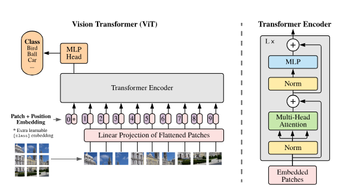

# 🧠 DEEP_NETWORK_SCRATCH

A hands-on deep learning repository where I build and experiment with different **neural network architectures using PyTorch**.

The main goal of this repository is to understand how deep learning models work internally by implementing, training, and experimenting with different architectures.
 ## 🔬 Vision Transformer (ViT)

Implemented a **Vision Transformer from scratch using PyTorch** for MNIST classification.

### Implementation
- Split images into **7×7 patches** using `Conv2d`
- Convert patches into **64-dimensional embeddings**
- Added **learnable CLS token** and **positional embeddings**
- Implemented **Transformer Encoder blocks** with:
  - Multi-Head Self Attention
  - Layer Normalization
  - MLP
  - Residual Connections
- Added an **MLP classification head**
- Trained the model using **Adam optimizer** and **Cross-Entropy Loss**

**Dataset:** MNIST  
**Embedding Dimension:** 64  
**Attention Heads:** 4  
**Transformer Blocks:** 4  
**Patch Size:** 7×7
